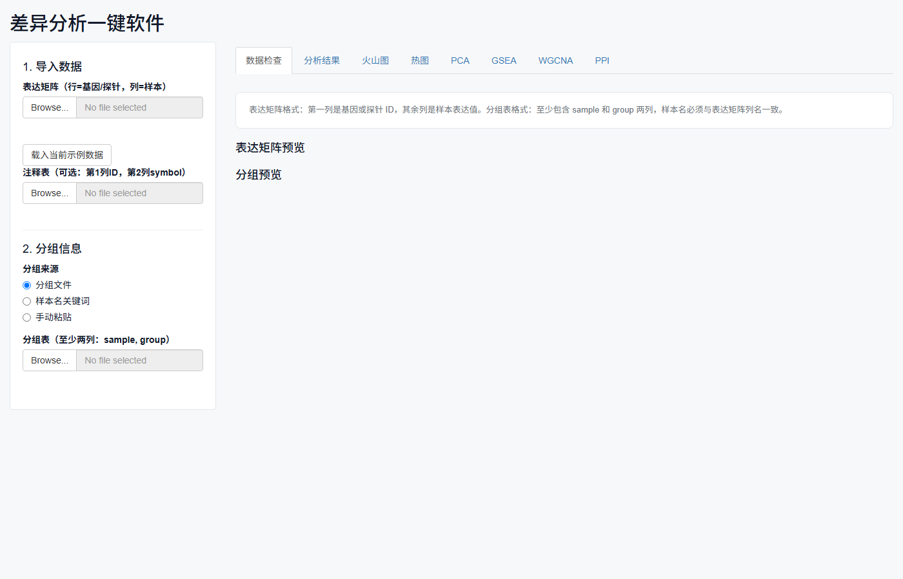
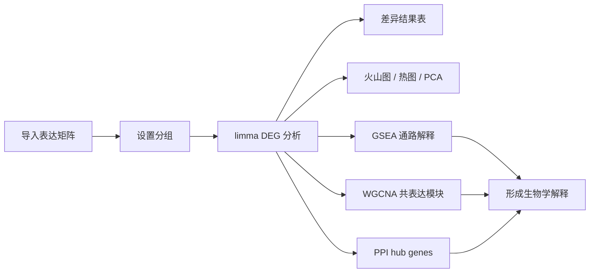
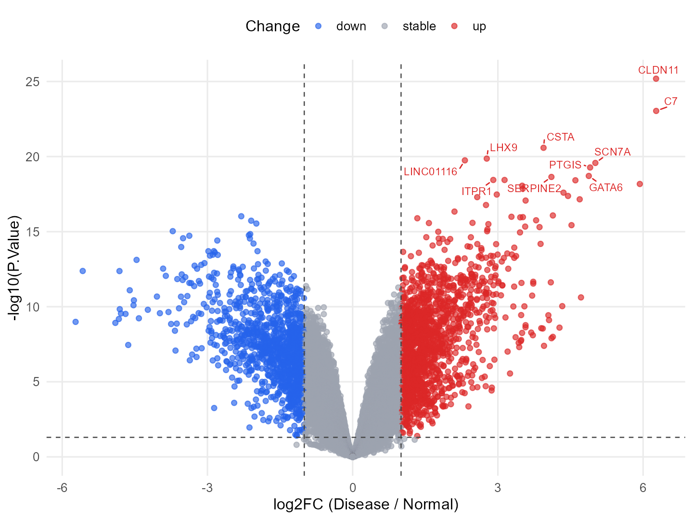
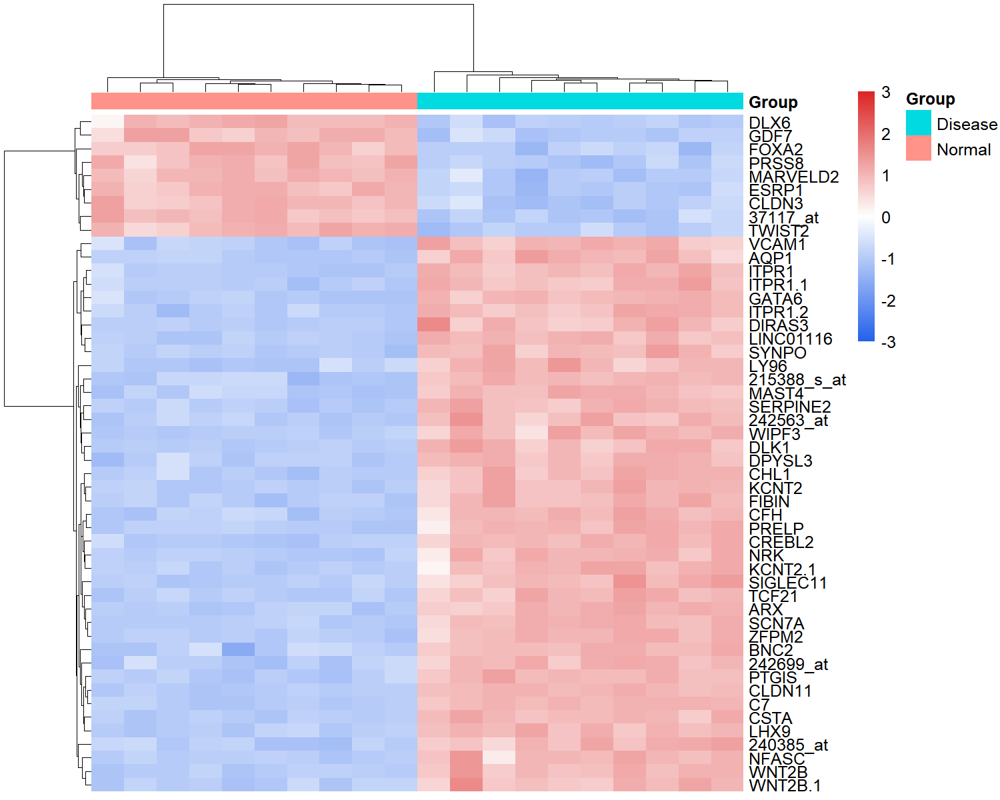
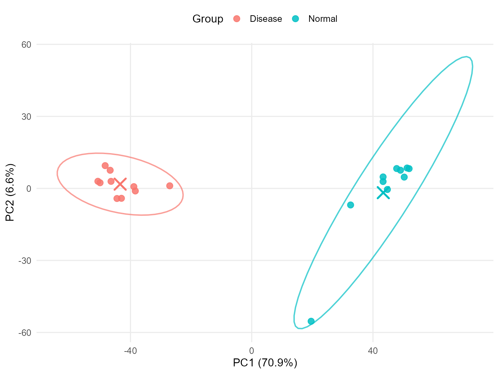
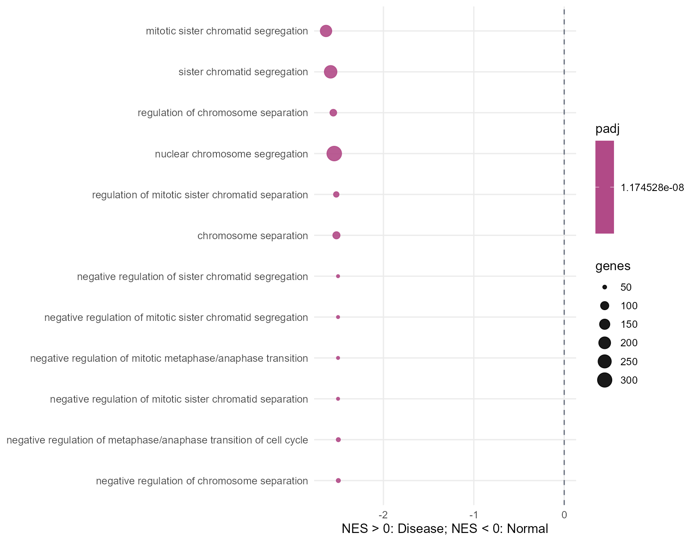
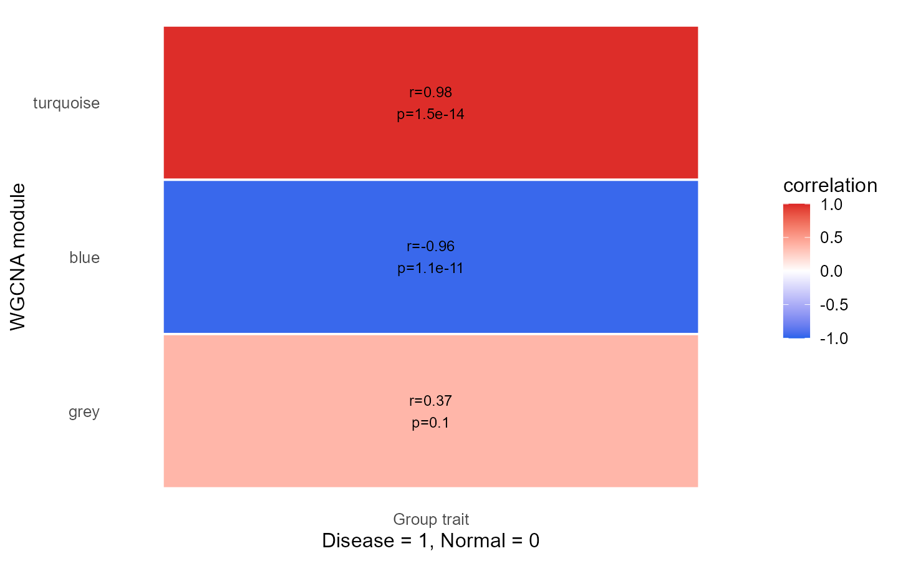
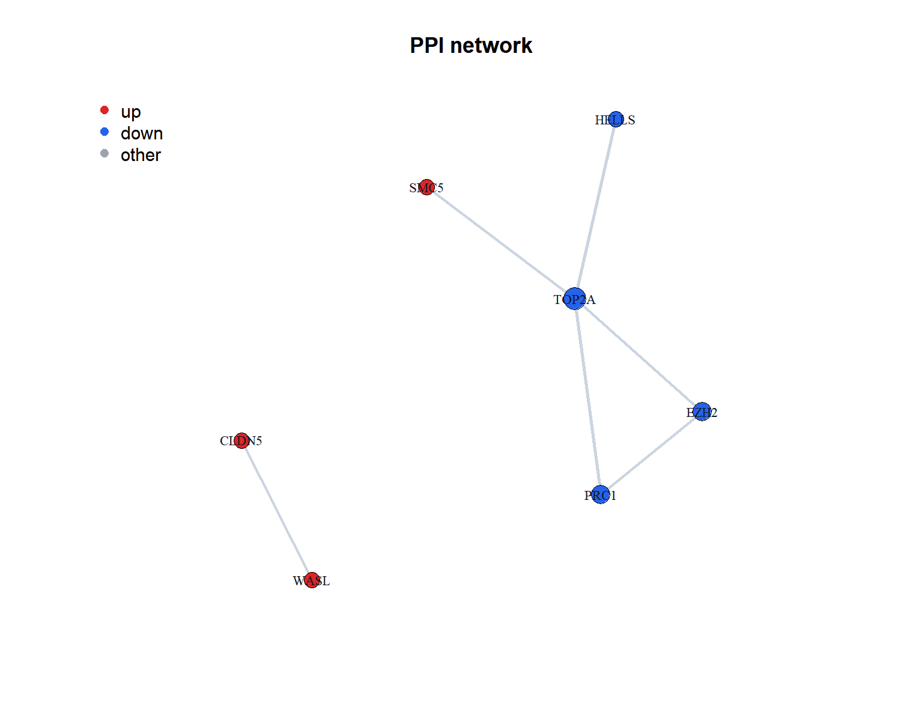

# BioInsight 一键生信分析平台


> 面向生信入门、课题组教学和非编程用户的 Windows 本地生信分析平台：导入表达矩阵和分组表，一键得到 DEG、火山图、热图、PCA、GSEA、WGCNA 和 PPI。

[](#一键安装)
[](#本地开发)
[](https://github.com/HaPiJiucHi/bioinsight-oneclick/releases/tag/v1.2.0)
[](LICENSE)



## 它解决什么问题？

很多表达谱分析卡在第一步：不会写 R、分组表容易错、画图参数分散、结果不知道怎么解释。BioInsight 把常用流程做成图形界面：

- **一键导入**：表达矩阵、分组表、注释表。
- **一键分析**：`limma` DEG 分析，自动生成差异表。
- **一键出图**：火山图、热图、PCA。
- **机制解释**：GSEA 看通路整体偏向，WGCNA 看共表达模块，PPI 找候选 hub genes。
- **适合教学**：界面、参数和结果都能截图讲解，适合课程、组会和短视频演示。

## 一键安装

1. 打开 [Release v1.2.0](https://github.com/HaPiJiucHi/bioinsight-oneclick/releases/tag/v1.2.0)。
2. 下载 `BioInsight-OneClick-Bioinformatics-v1.2.0.zip`。
3. 解压后双击 `BioInsight 一键生信分析平台.exe`。
4. 第一次运行如果提示缺少依赖，点击“检查依赖”。

如果电脑没有 R，启动器会尝试把 R 安装到软件同目录下的 `R` 文件夹，尽量减少系统环境配置。

## 分析流程



## 结果展示

| 火山图：显著基因标注 | 热图：差异基因表达模式 |
|---|---|
|  |  |

| PCA：椭圆和中心点 | GSEA：通路整体偏向 |
|---|---|
|  |  |

| WGCNA：模块-分组相关 | PPI：候选 hub genes |
|---|---|
|  |  |

## 示例数据能讲出什么？

内置示例数据包含 20 个样本：Normal 10 个、Disease 10 个。验证结果显示：

- 上调基因：1624 个。
- 下调基因：1179 个。
- GSEA 靠前结果集中在姐妹染色单体分离、染色体分离、核染色体分离等细胞周期相关过程。
- WGCNA 中 turquoise 模块偏向 Disease，blue 模块偏向 Normal。
- PPI 中 TOP2A、PRC1、EZH2 等可作为后续验证候选。

推荐解读主线：

```text
DEG 确定显著变化基因
GSEA 解释整体通路偏向
WGCNA 辅助证明模块化共表达结构
PPI 排序后续实验候选 hub genes
```

## 输入格式

表达矩阵：第一列是基因或探针 ID，其余列是样本表达值。

```csv
feature_id,Sample_1,Sample_2,Sample_3,Sample_4
GeneA,8.1,8.3,10.2,10.0
GeneB,5.0,5.2,4.8,4.7
```

分组表：至少包含样本名和分组名两列。

```csv
sample,group
Sample_1,Control
Sample_2,Control
Sample_3,Treatment
Sample_4,Treatment
```

注释表可选：第一列为表达矩阵里的 ID，第二列为基因 symbol。

## 功能清单

- 支持 `.csv`、`.tsv`、`.txt`、`.xlsx`、`.xls`。
- 支持分组文件、样本名关键词、手动粘贴三种分组方式。
- DEG 参数放在“分析结果”页签顶部。
- 火山图支持颜色调整和 Top 显著基因名称标注。
- 热图支持行聚类、列聚类开关和颜色调整。
- PCA 支持分组椭圆和分组中心点。
- GSEA 支持 GO BP、MF、CC，并在界面下方解释为什么使用 GSEA。
- WGCNA 输出模块相关性和模块 hub genes。
- PPI 默认读取同目录 `string_interactions.tsv`，也可上传自己的 STRING interaction 文件。

## 适合怎么做教学视频？

推荐 60 秒结构：

1. **开头 3 秒**：不用写代码，表达矩阵导入后直接出图。
2. **10 秒展示导入**：表达矩阵、分组表、注释表。
3. **15 秒展示结果**：火山图、热图、PCA。
4. **20 秒讲机制**：GSEA 看通路，WGCNA 看模块，PPI 找 hub gene。
5. **结尾引导**：GitHub 免费下载，Release 里有 zip，Star 后持续更新。

详细脚本见：[抖音视频脚本](docs/DOUYIN_VIDEO_SCRIPT.md)。

## 本地开发

安装依赖：

```powershell
& "C:\Program Files\R\R-4.5.3\bin\Rscript.exe" .\install_dependencies.R
```

运行自测：

```powershell
& "C:\Program Files\R\R-4.5.3\bin\Rscript.exe" .\test_app.R
```

生成 README 展示图：

```powershell
cd scripts
& "C:\Program Files\R\R-4.5.3\bin\Rscript.exe" .\create_readme_assets.R
```

直接启动 Shiny：

```powershell
& "C:\Program Files\R\R-4.5.3\bin\Rscript.exe" -e "shiny::runApp('.', launch.browser = TRUE, host = '127.0.0.1', port = 3838)"
```

## 文档

- [安装说明](docs/INSTALL.md)
- [使用说明](docs/USAGE.md)
- [常见问题](docs/FAQ.md)
- [抖音视频脚本](docs/DOUYIN_VIDEO_SCRIPT.md)
- [版本发布说明](RELEASE_NOTES.md)

## 许可

本项目使用 MIT License。见 [LICENSE](LICENSE)。

