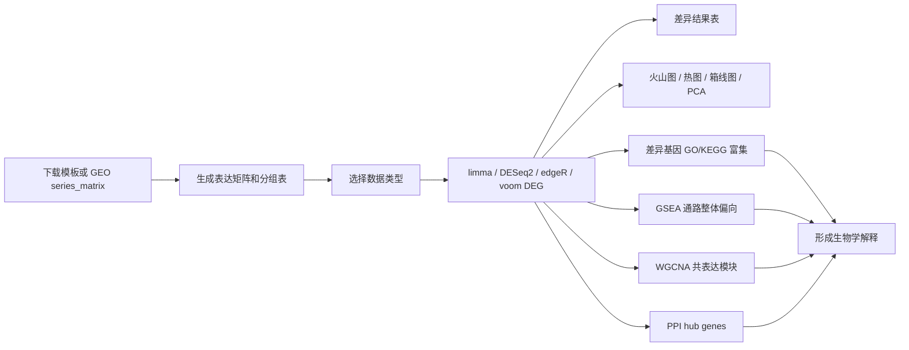

# BioInsight 一键生信分析平台


> 面向生信入门、课题组教学和非编程用户的 Windows 本地生信分析平台：导入表达矩阵和分组信息，一键完成 DEG、质控图、富集分析、GSEA、WGCNA 和 PPI。

[](#一键安装)
[](#本地开发)
[](https://github.com/HaPiJiucHi/bioinsight-oneclick/releases/tag/v1.5.2)
[](LICENSE)


## 它解决什么问题？

很多表达谱分析卡在第一步：不会写 R、分组表容易错、画图参数分散、结果不知道怎么解释。BioInsight 把常用流程做成图形界面：

- **一键导入**：表达矩阵、分组表、注释表。
- **新手数据准备**：提供表达矩阵/分组表模板，并支持 GEO `series_matrix.txt.gz` 拆分表达矩阵和样本信息。
- **一键分析**：自动识别数据类型并选择 `limma`、`DESeq2`、`edgeR` 或 `limma-voom`，自动生成差异表。
- **一键出图**：火山图、热图、箱线图、PCA。
- **机制解释**：差异基因 GO/KEGG 富集、GSEA、WGCNA 和 PPI。

## 一键安装

1. 打开 [Release v1.5.2](https://github.com/HaPiJiucHi/bioinsight-oneclick/releases/tag/v1.5.2)。
2. 下载 `BioInsight-OneClick-Bioinformatics-v1.5.2.zip`。
3. 解压后双击 `BioInsight 一键生信分析平台.exe`。
4. 第一次运行如果提示缺少依赖，点击“检查依赖”。

如果电脑没有 R，启动器会尝试把 R 安装到软件同目录下的 `R` 文件夹。

## 新手怎么准备输入文件？

最省事有三种方式：

1. **先跑示例**：点击左侧“载入当前示例数据”，熟悉完整流程。
2. **按模板整理**：下载“表达矩阵模板”和“分组表模板”，照着填自己的数据。
3. **用 GEO 文件拆分**：在 GEO 页面下载 `series_matrix.txt.gz`，上传到软件里的 GEO 入口，软件会拆出表达矩阵和样本信息表；如果样本信息里有 disease、treatment、group 等字段，可以选择该列一键生成分组表。

详细说明见：[新手数据准备](docs/DATA_PREP.md)。

## 不知道自己的数据类型怎么选？

软件默认会在“数据检查”页自动判断并选择分析方法。简单记：

- **RNA-seq raw counts**：值基本都是整数，例如 0、1、2、150、3000，文件名常见 `count`、`counts`、`readcount`。正式 RNA-seq 差异分析优先选这个，自动模式默认用 `DESeq2`，并默认过滤总 counts 小于 2 的极低表达基因。
- **RNA-seq TPM/FPKM/RPKM**：值经常带小数，文件名常见 `TPM`、`FPKM`、`RPKM`。适合快速探索、作图、GSEA、WGCNA。
- **芯片/已标准化表达矩阵**：GEO 芯片或 normalized expression，值通常是 log2 后的小数，有时会有负值。使用 `limma`。
- **差异结果表不是表达矩阵**：如果文件已经有 `logFC`、`P.Value`、`padj`，它是分析结果，不能直接当表达矩阵导入。

## 分析流程



## 结果展示

| 火山图：显著基因标注 | 热图：差异基因表达模式 |
|---|---|
|  |  |

| PCA：椭圆和中心点 | GSEA：通路整体偏向 |
|---|---|
|  |  |

| WGCNA：模块-分组相关 | PPI：候选 hub genes |
|---|---|
|  |  |

## 功能清单

- 支持 `.csv`、`.tsv`、`.txt`、`.xlsx`、`.xls`。
- 支持 GEO `series_matrix.txt.gz` 拆分表达矩阵和样本信息。
- 支持分组文件、样本名关键词、手动粘贴、GEO 样本信息列生成分组。
- 支持自动识别芯片/标准化表达矩阵、RNA-seq TPM/FPKM/RPKM、RNA-seq raw counts。
- RNA-seq raw counts 支持 `DESeq2`、`edgeR` 和 `limma-voom`，默认先过滤总 counts 小于 2 的极低表达基因，可在“数据检查”页调整。
- 火山图支持颜色调整，并可分别控制升高/降低基因名称标注。
- 热图支持行聚类、列聚类开关和颜色调整。
- 箱线图用于检查样本整体表达分布和特殊样本。
- PCA 支持分组椭圆和分组中心点。
- 差异基因富集分析支持上调、下调、合并和上/下调分别分析，支持 GO BP、MF、CC、GO All 和 KEGG。
- GSEA 支持 GO BP、MF、CC 和 KEGG，running enrichment 区域会显示 NES 和核心基因表。
- WGCNA 输出模块相关性和模块 hub genes。
- PPI 支持显著差异基因或从当前矩阵中搜索选择候选基因，支持在线 STRING 查询，也可上传公司同款 STRING interaction 文件。

## 本地开发

安装依赖：

```powershell
& "C:\Program Files\R\R-4.5.3\bin\Rscript.exe" .\install_dependencies.R
```

运行自测：

```powershell
& "C:\Program Files\R\R-4.5.3\bin\Rscript.exe" .\test_app.R
```

直接启动 Shiny：

```powershell
& "C:\Program Files\R\R-4.5.3\bin\Rscript.exe" -e "shiny::runApp('.', launch.browser = TRUE, host = '127.0.0.1', port = 3838)"
```

## 文档

- [安装说明](docs/INSTALL.md)
- [新手数据准备](docs/DATA_PREP.md)
- [使用说明](docs/USAGE.md)
- [常见问题](docs/FAQ.md)
- [版本发布说明](RELEASE_NOTES.md)

## 许可

本项目使用 MIT License。见 [LICENSE](LICENSE)。
